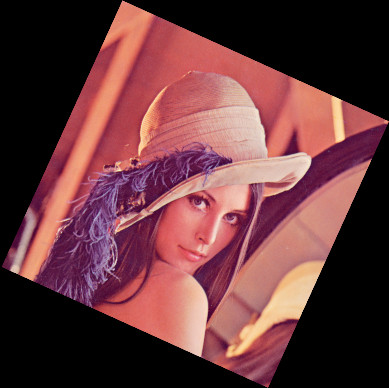
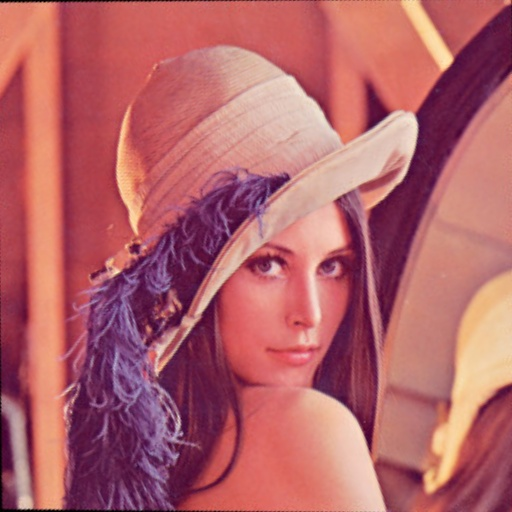
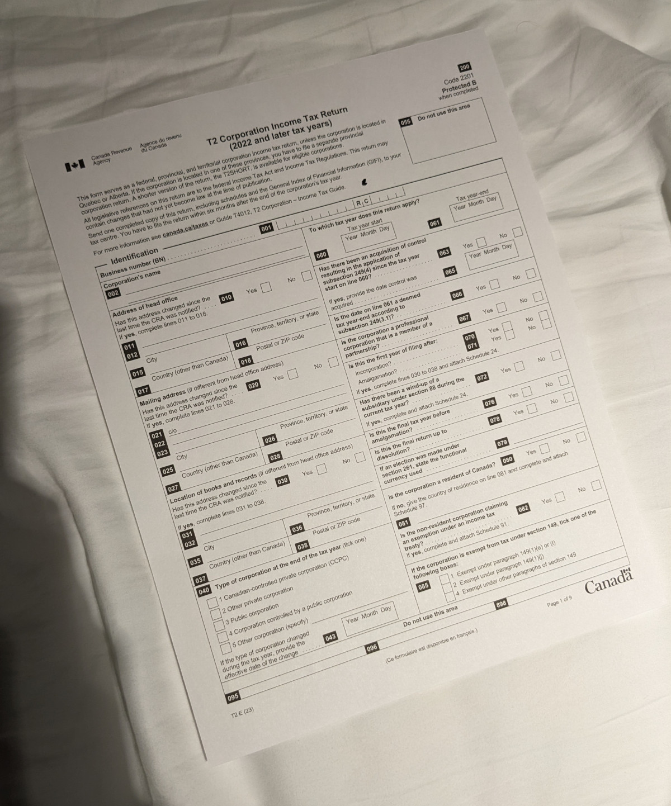
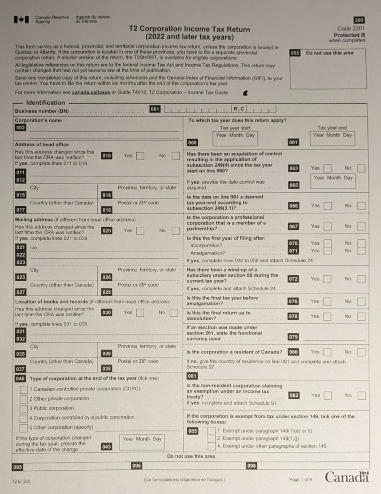

# imagealign

A cli tool for image registration using opencv ([gocv](https://github.com/hybridgroup/gocv)) feature detection + homography.

## Usage

```bash
imagealign -i ./img/lenna_skewed.jpg -r ./img/lenna.jpg -o ./fixed.png
```

The most minimal usage of `imagealign` requires three parameters:

- the input (skewed image to align)
- the reference (image to align with)
- the output path

`imagealign` should support all image mimetypes that opencv supports (but has only been tested with png/jpg):

- Windows bitmap (bmp)
- JPEG (jpeg, jpg, jpe)
- JPEG 2000 (jp2)
- TIFF files (tiff, tif)
- Portable network graphics (png)
- [...and more](https://docs.opencv.org/4.x/d4/da8/group__imgcodecs.html#ga288b8b3da0892bd651fce07b3bbd3a56)

## Command line options:

| Param             | Type   | Description                                                                           |
| ----------------- | ------ | ------------------------------------------------------------------------------------- |
| -i or --input     | string | Path to the input image                                                               |
| -r or --reference | string | Path to the reference image                                                           |
| -o or --output    | string | Path to write the output image to                                                     |
| -p or --percent   | float  | Optional percentage of matches to use from opencv feature detection (defaults to 0.7) |
| -m or --mask      | string | Optional mask path to use for feature detection on the input image                    |

## Installation

First ensure opencv is installed (contrib needed for testing). A detailed installation process can be found in the [gocv](https://github.com/hybridgroup/gocv#how-to-install) repo.

`imagealign` was made using go v1.21, previous versions are untested.

```bash
// clone repo
$ git clone https://github.com/Cartermel/imagealign.git --depth=1

$ cd imagealign

$ go install
```

## Examples

(reference images located in the ./img directory)

<table>
<thead>
    <tr>
        <td>Input</td>
        <td>Output</td>
    </tr>
</thead>

<tbody>
    <tr>
        <td></td>
        <td></td>
    </tr>
    <tr>
        <td></td>
        <td></td>
    </tr>
</tbody>
</table>
